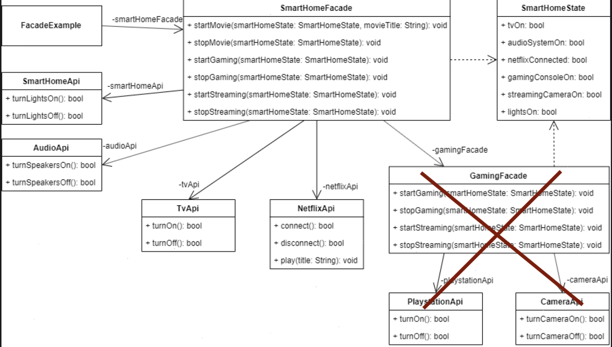

# facade_patterns

Facade 패턴은 복잡한 클래스 시스템에 단순화된 인터페이스를 제공하는 구조적 디자인 패턴입니다. 
시스템의 복잡성을 숨기고 사용하기 쉽고 이해하기 쉬운 고급 인터페이스를 제공하여 
시스템 사용을 단순화하는 것을 목표로 합니다.

## Getting Started

- [Design Patterns_Flutter](https://kazlauskas.dev/flutter-design-patterns-7-facade/)

##lib

